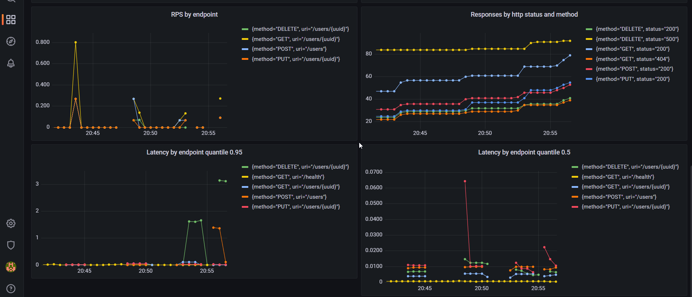
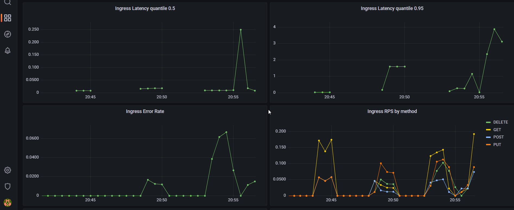
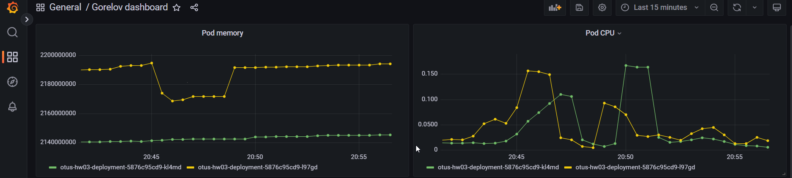

Домашнее задание №3

Дашборд приложения:

Дашборд ingress-controller

Поды

Инструкция по запуску и установке:

1) Установить в кластере prometheus:
   - kubectl create namespace prometheus
   - helm repo add prometheus-community https://prometheus-community.github.io/helm-charts
   - helm repo update 
   - helm install prometheus prometheus-community/kube-prometheus-stack -n prometheus -f ./hw3/stack-values.yaml -f ./hw3/prometheus.yaml

2) Развернуть приложение в кластере:
   В корне проекта выполнить:
   - helm install gorelov-arch-hw3 ./hw3

3) Для очистки пространтсва выполнить:
   - helm uninstall gorelov-arch-hw3
   - helm uninstall prometheus -n prometheus

Для доступа к UI prometheus:
- kubectl port-forward -n prometheus service/prometheus-operated 9090:9090

Для доступа к UI grafana:
- kubectl port-forward -n prometheus service/prometheus-grafana 9000:80

Если нет метрик nginx:
- helm upgrade --install nginx ingress-nginx/ingress-nginx --namespace m -f nginx-ingress.yaml
  
Проверка конфига nginx-controller:
- kubectl -n m get po nginx-ingress-nginx-controller-7vfb9 -o yaml
- kubectl exec -it -n m nginx-ingress-nginx-controller-rsx8s -- curl localhost:10254/metrics
  
Проверить конфиг nginx и prometheus:
- helm get values nginx -n m
- helm get values prometheus -n prometheus