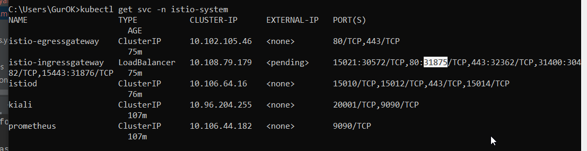
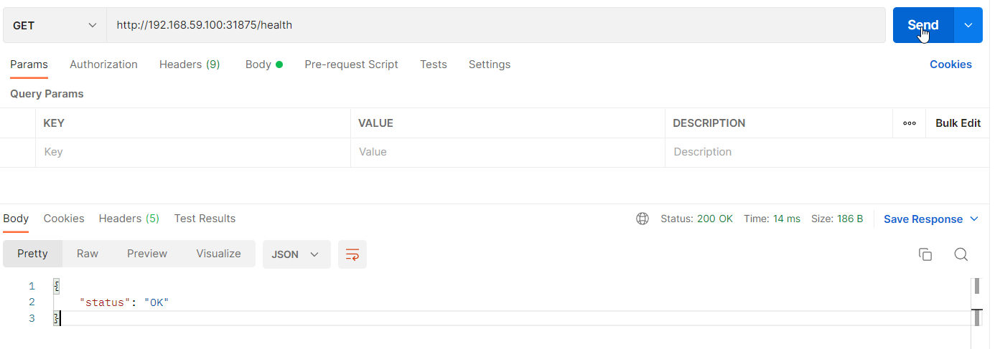
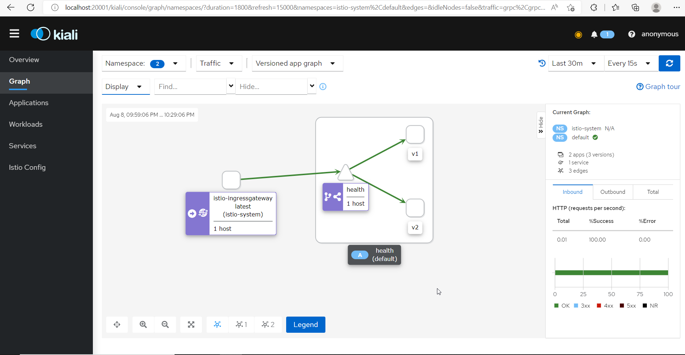

### Домашнее задание №4. Istio

В кластере взамен nginx ставится Istio с балансировкой трафика на две версии микросервиса.

#### Инструкция по запуску:
- `minikube start`
- `kubectl delete namespace ingress-nginx`
- `kubectl delete ingressClass nginx`  
- `istioctl install --set profile=demo -y`
- `kubectl apply -f https://raw.githubusercontent.com/istio/istio/release-1.11/samples/addons/prometheus.yaml`
- `kubectl apply -f https://raw.githubusercontent.com/istio/istio/release-1.11/samples/addons/kiali.yaml`
- `helm install gorelov-arch-hw4 ./hw4`
- `kubectl label namespace default istio-injection=enabled`

- Узнать порт istio-ingressgateway:
  `kubectl get svc -n istio-system`
  
  
- Отправить запросы на http://{{minikube_ip}}:{{istio_port}}/health

  
- istioctl dashboard kiali

---
#### Очистка пространства:

  - `helm uninstall gorelov-arch-hw4`
  - `istioctl x uninstall --purge`
  - `kubectl delete namespace istio-system`  