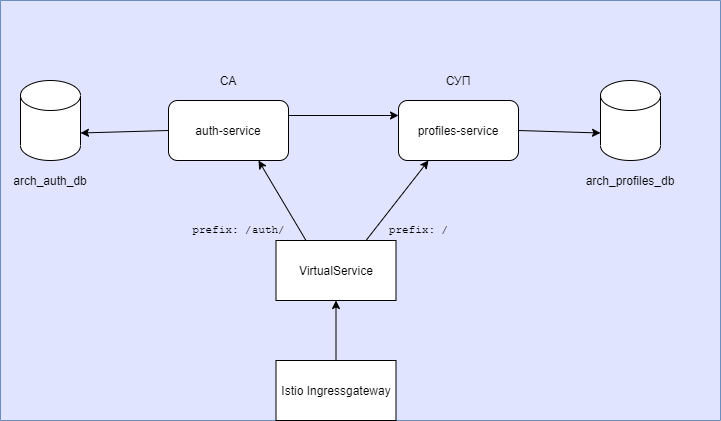
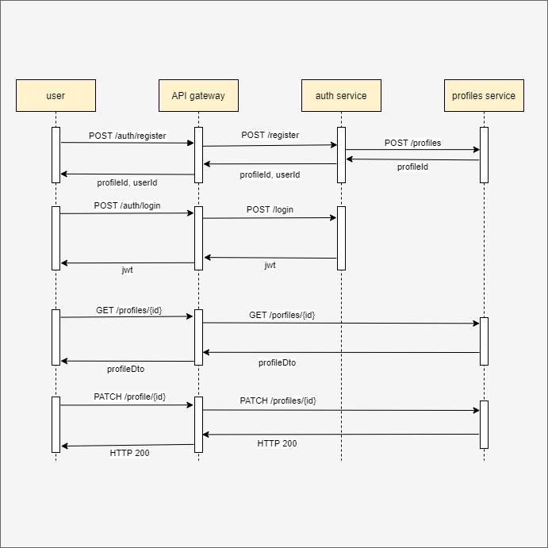
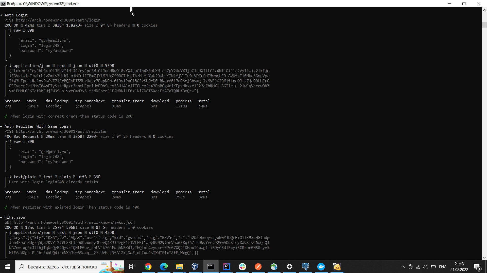
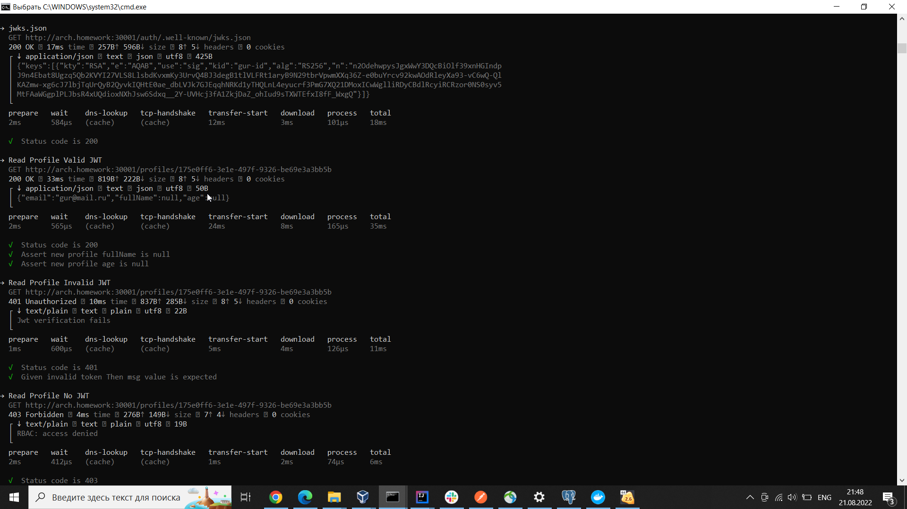
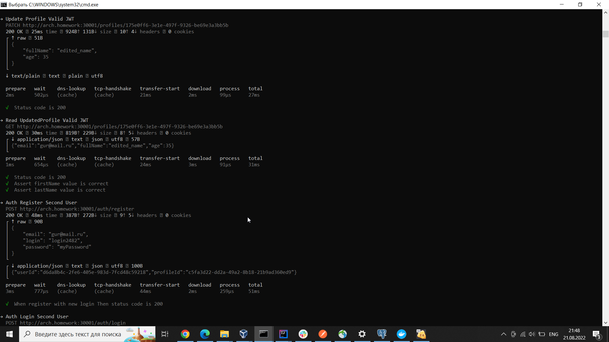
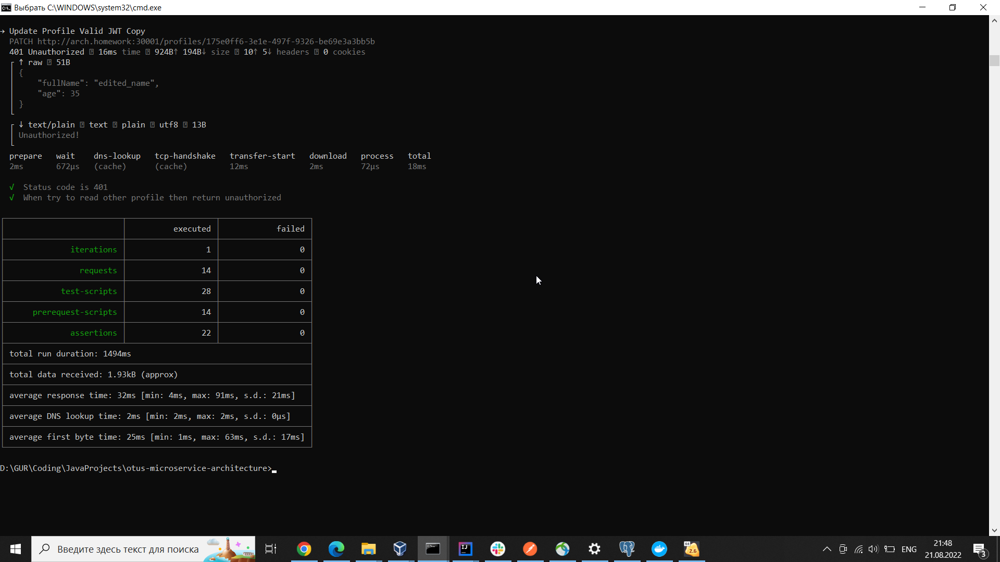

Домашнее задание №5

<u>Описание приложения:</u>

1) Компоненты приложения:

- Сервис Аутентификации (СА) https://github.com/GUR-ok/arch-auth https://hub.docker.com/repository/docker/gurok/arch_auth 
- Сервис Управления Профилем (СУП) https://github.com/GUR-ok/arch-profiles https://hub.docker.com/repository/docker/gurok/arch_profiles
- настроенный Istio API-gateway с проверкой авторизации по jwt.
- БД: каждый микросервис подключен к своей БД:
  СА хранит данные юзеров (userId, login, password, profileId), СУП хранит данные профиля (profileId, fullName, age,
  ...).
2) Запросы на /auth/ не требуют авторизации (перенаправляются на СА), остальные запросы требуют передачи валидного jwt (
   перенаправляются на СУП).
3) Пользователю доступны API /auth/register, /auth/login, а также API управления Профилем с доступом по токену
   авторизации.
4) При первичной регистрации пользователя на /auth/register СА обращается к СУП для создания профиля. Полученный
   profileId привязывается к userId.
5) После регистрации клиент может залогиниться на /auth/login, в ответ получит подписанный сервисом аутентификации jwt.
   Jwt содержит id профиля profileId (из сервиса управления Профилем), созданного при регистрации.
6) Сервис аутентификации СА имеет пару ключей (хранятся в jks): приватным ключом подписывается jwt; публичный ключ
   открытый, предоставляется по адресу /auth/.well-known/jwks.json
7) Istio ingressgateway настроен на проверку валидности подписи jwt при помощи публичного ключа. 
   При валидном jwt полезные данные из jwt направляются header'ом "x-jwt-token" в микросервис.
8) При запросе изменения профиля в СУП проверяется profileId из jwt на совпадение с id запрашиваемого профиля. В случае
   попытки запроса чужого профиля запрос считается неавторизованным. Верификация и проверка подписи jwt в СУП не
   производится, за верификацию отвечает Istio.

<u>Инструкция по запуску:</u>

- kubectl create namespace arch-gur
- istioctl install --set profile=demo -y
- istioctl manifest apply -f ./hw5/istio/istio-values.yaml
- helm install gorelov-arch-hw5 ./hw5/istio/
- helm install gorelov-arch-auth ./hw5/auth_deployment/
- helm install gorelov-arch-profiles ./hw5/profiles_deployment/

<u>Тесты:</u>

- newman run ./hw5/gorelov_hw_5.postman_collection.json --verbose

<u>Проверка портов и istio:</u>

- kubectl get virtualService
- kubectl get svc -n istio-system
  (должен быть порт 30001)

---
<u>Очистка пространства:</u>

- helm uninstall gorelov-arch-hw5
- helm uninstall gorelov-arch-auth
- helm uninstall gorelov-arch-profiles
- istioctl x uninstall --purge
- kubectl delete namespace arch-gur

Результаты тестов:

