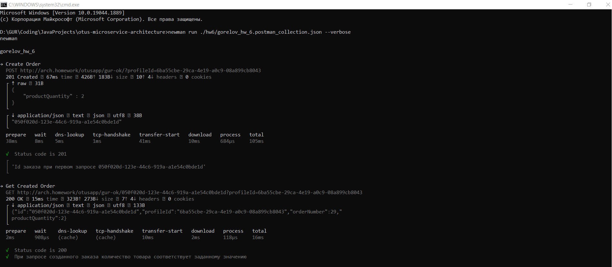
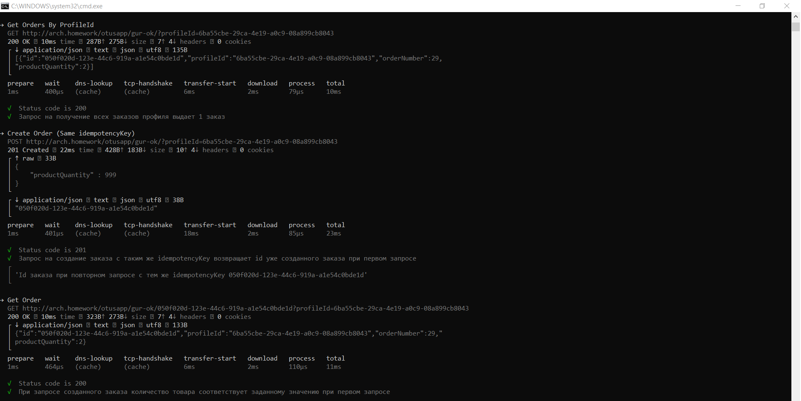
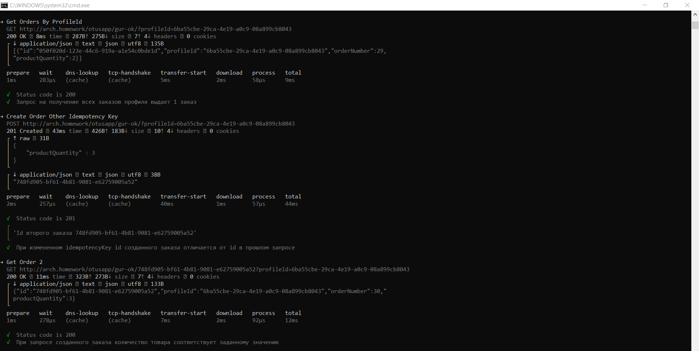
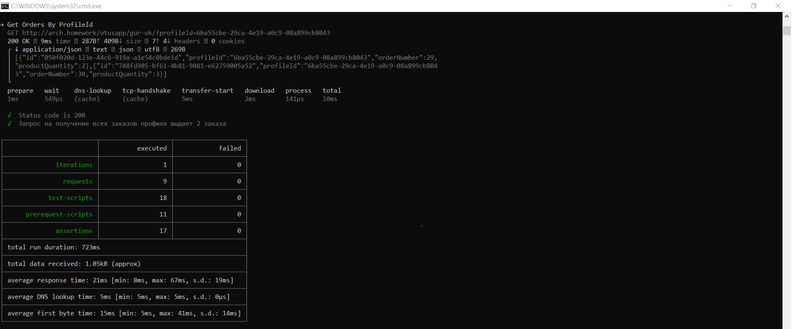

### Домашнее задание №6. Idempotency

Релизовать идемпотентный метод создания заказа.

#### Описание приложения:
Приложение сосотоит из:
- Сервис Управления Заказом.
- Реляционная БД PostgreSQL
- Redis для хранения ключей идемпотентности

Особенности работы:
- В headers (key: idempotency-key) передается ключ идемпотентности (Ключ). Повторные последующие запросы на
  создание заказа с тем же Ключом возвращают orderId заказа, созданного при первом запросе.
- При получении запроса на создание заказа, проверяется наличие Ключа в Redis БД, 
  если Ключ не найден, то он сохраняется в Redis и заказ создается в Postgres БД и возвращается уникальный orderId.
  Если Ключ найден в Redis, то новый заказ в Postgres не создается, в ответе возвращается orderId уже созданного заказа.
- В Redis хранится Ключ и oderId идентификатор заказа, созданного с помощью этого Ключа. Это позволяет возвращать 
  orderId при повторных запросах с одинаковым Ключом.
- Развернутая в кластере Redis БД служит хранилищем Ключей для всех экземпляров Сервиса Управления Заказом.

#### Инструкция по запуску:
- `minikube start`
- `kubectl create namespace arch-gur`  
- Использовать nginx ingress controller установленный через хелм, а не встроенный в minikube:

```
kubectl delete namespace ingress-nginx
kubectl delete ingressClass nginx
kubectl create namespace m && helm repo add ingress-nginx https://kubernetes.github.io/ingress-nginx/ && helm repo update && helm install nginx ingress-nginx/ingress-nginx --namespace m -f nginx-ingress.yaml
```

- `helm install gorelov-redis ./hw6/redis/`
- `helm install gorelov-arch-order ./hw6/order_deployment/`

#### Тесты:

- `newman run ./hw6/gorelov_hw_6.postman_collection.json --verbose`

#### Результаты тестов:





---

#### Проверка и отладка:
- Доступ к редис:
`kubectl port-forward -n arch-gur redis-order-statefulset-0 6379:6379`

- В случае ошибки при делое приложения через helm

    Error: INSTALLATION FAILED: Internal error occurred: failed calling webhook "validate.nginx.ingress.kubernetes.io": Post "https://ingress-nginx-controller-admission.ingress-nginx.svc:4
    43/networking/v1/ingresses?timeout=10s": dial tcp 10.111.50.42:443: connect: connection refused
    
    необходимо выполнить:
    ```
    get ValidatingWebhookConfiguration
    kubectl delete -A ValidatingWebhookConfiguration ingress-nginx-admission
    ```

#### Очистка пространства:

- `helm uninstall gorelov-arch-order`
- `helm uninstall gorelov-redis`
- `helm uninstall nginx -n m`
- `kubectl delete namespace arch-gur`
- `kubectl delete namespace m`