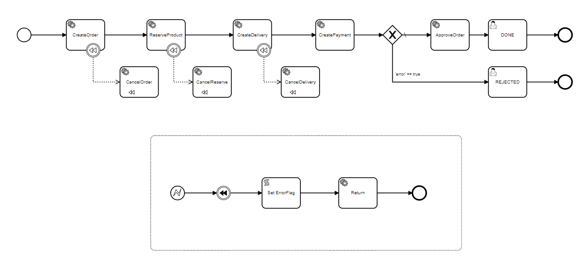
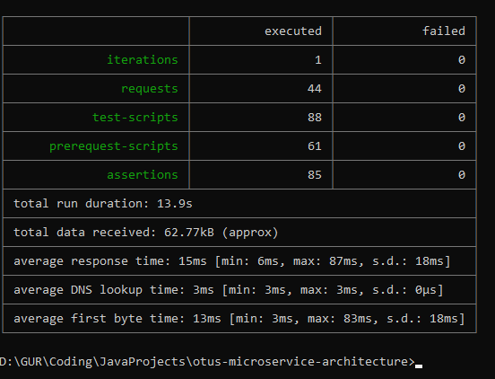
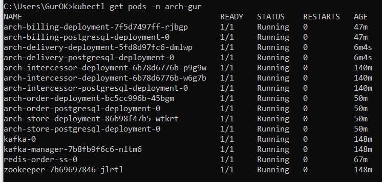

## Домашнее задание №8. Distributed transactions

Реализовать распределенную транзакцию в микросервисной архитектуре

---


### Описание приложения:
Приложение реализует паттерн "Сага" для построения распределенной транзакции и состоит из:
- [Интерцессор (Сервис Оркестратор)](https://github.com/GUR-ok/arch-intercessor)
  Сервис под управлением Camunda (встроена в SpringBoot), основывается на bpmn-схеме, 
  к которой привязаны java-делегаты. Интеграция с другими сервисами осуществляется как по REST-api, 
  так и через брокеры сообщений. Входящие запросы - по HTTP.
  Отмена локальных транзакций в микросервисах осуществляется посредством компенсирующих вызовов (паттерн "Сага").
  В случае возникновения исключений на шагах распредлеленной транзакции механизмы Camunda перехватят ошибку и 
  произведут компенсирующие действия только для пройденных шагов.
  Camunda позволяет дополнительно настраивать ретраи, что при реализации идемпотентных api значительно повысит надежность системы.

- [Сервис Заказа](https://github.com/GUR-ok/arch-order)
  При старте процесса оформления заказа в сервисе создается "заказ" в статусе PENDING.
  При успешной оплате статус заказа изменяется на APPROVED.
  В случае ошибки на любом шаге, предшествующем оплате, заказ будет переведен в статуст CANCELED компенсирующей транзакцией.
  Создание заказа - по REST API. Изменение статуса заказа - через брокер сообщений.

- [Сервис Склада](https://github.com/GUR-ok/arch-store)
  Сервис хранит информацию о товарах, их цене, количестве, доступности на складе.
  Также сервис хранит информацию о заказанных товарах в отдельной таблице. При резервировании товара в заказ, доступное количество уменьшается.
  При отмене заказа количество на складе пересчитывается соответствующим образом, а записи из таблицы заказанных товаров удаляются.
  Добавление нового товара, добавление товара в заказ - по REST API. Отмена заказанных товаров - через брокер сообщений.
  
- [Сервис Доставки](https://github.com/GUR-ok/arch-delivery)
  Сервис бронирования доставки. Доставка бронируется по дате и времени суток (MORNING, AFTERNOON, EVENING).
  Невозможно забронировать два заказа на одну и ту же дату с одним таймслотом.
  На один заказ может быть забронирована только одна доставка. При отмене доставки запись из БД удаляется.
  Создание доставки - по REST API. Отмена доставки - через брокер сообщений.
  
- [Сервис Биллинга](https://github.com/GUR-ok/arch-billing)
  Сервис управления балансом на счете. Списание средств происходит только при наличии достаточного количества денег.
  При недостаточном количестве средтсв сервис бросает исключение, распределенная транзакция отменяется,
  выполняются компенсирующие операции по отмене заказа, отмене доставки, отмене резервирования товаров на складе.
  Оплата является поворотной транзакцией. После ее успешного выполнения заказ считается подтвержденным и должен выполниться в любом случае.
  При успешной оплате статус заказа изменяется на APPROVED.

---

### Инструкция по запуску:
- `minikube start --vm-driver virtualbox --no-vtx-check --memory=24Gb --cpus=4 --disk-size=50Gb`
- `kubectl create namespace arch-gur`
- Использовать nginx ingress controller установленный через хелм, а не встроенный в minikube:

  ```
  kubectl delete namespace ingress-nginx
  kubectl delete ingressClass nginx
  kubectl create namespace m && helm repo add ingress-nginx https://kubernetes.github.io/ingress-nginx/ && helm repo update && helm install nginx ingress-nginx/ingress-nginx --namespace m -f nginx-ingress.yaml
  ```
  
- `helm install gorelov-kafka ./hw8/kafka/`
- `helm install gorelov-redis-order ./hw8/redis_order/`  
- `helm install gorelov-intercessor ./hw8/intercessor_deployment/`
- `helm install gorelov-arch-order ./hw8/order_deployment/`
- `helm install gorelov-arch-store ./hw8/store_deployment/`
- `helm install gorelov-arch-delivery ./hw8/delivery_deployment/`
- `helm install gorelov-arch-billing ./hw8/billing_deployment/`

  `kubectl get pods -n arch-gur`
- В случае ошибки при деплое приложения через helm

  Error: INSTALLATION FAILED: Internal error occurred: failed calling webhook "validate.nginx.ingress.kubernetes.io": Post "https://ingress-nginx-controller-admission.ingress-nginx.svc:4
  43/networking/v1/ingresses?timeout=10s": dial tcp 10.111.50.42:443: connect: connection refused

  необходимо выполнить:
    ```
    kubectl get ValidatingWebhookConfiguration
    kubectl delete -A ValidatingWebhookConfiguration nginx-ingress-nginx-admission
    ```  
- дождаться поднятия подов
- на все поды может не хватать ресурсов, следует запускать по очереди, для экономии ресурсов количество реплик сокращено до 1

---

### Тесты:

- `newman run ./hw8/gorelov_hw_8.postman_collection.json --verbose`

#### Результаты тестов:

 Скриншоты с тестами в [папке](./screenshots).



---

### Проверка и отладка:


- Port-forward:
  
  `kubectl get pods -n arch-gur`

  `kubectl port-forward -n arch-gur arch-order-postgresql-deployment-0 5433:5432`
  
  `kubectl port-forward -n arch-gur arch-intercessor-postgresql-deployment-0 5433:5432`
  
  `kubectl port-forward -n arch-gur arch-intercessor-deployment-76548647fd-bpxbj 8000:8000`

  Админская панель Camunda будет доступна по адресу: http://localhost:8080/camunda/app/admin/default/#/
  
   
### Очистка пространства:

- `helm uninstall gorelov-intercessor`
- `helm uninstall gorelov-kafka`
- `helm uninstall gorelov-arch-order`
- `helm uninstall gorelov-arch-store`
- `helm uninstall gorelov-arch-billing`
- `helm uninstall gorelov-arch-delivery`
- `helm uninstall gorelov-redis-order`
- `helm uninstall nginx -n m`
- `kubectl delete namespace arch-gur`
- `kubectl delete namespace m`