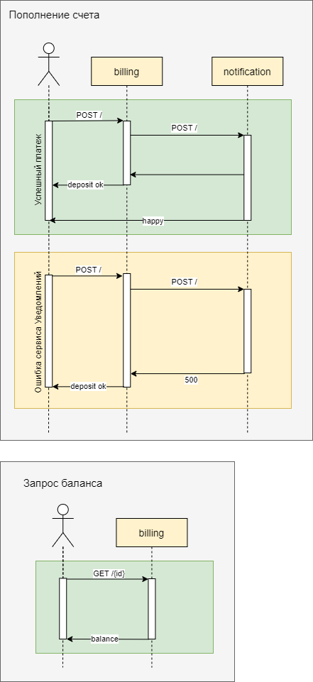
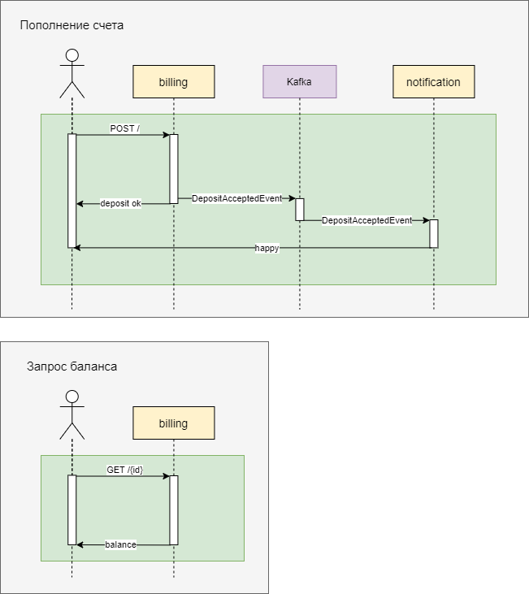

## Домашнее задание №9. Events

Реализовать событийное взаимодействие в микросервисной архитектуре

---

### Описание приложения:
- [Сервис Заказа](https://github.com/GUR-ok/arch-order)
  Пользователь имеет возможность создать заказ. Сервис делает запрос в сервис Биллинга для оплаты заказа.
  
- [Сервис Биллинга](https://github.com/GUR-ok/arch-billing)
  Пользователь имеет возможность пополнить счет. Сервис отправляет запрос в сервис Уведомлений для отправки псием клиенту.
  Сервис принимает запросы для оплаты созданного заказа.

- [Сервис Уведомлений](https://github.com/GUR-ok/arch-notification)
  Сервис принимает запросы для отправки писем клиенту

  ### I. Только HTTP взаимодействие.
  
  
  

  ### II. HTTP взаимодействие для оплаты, отправка уведмолений через брокера сообщений.
  
  
  

  ### III. Межсервисное взаимодействие посредством обмена сообщениями через брокера.
  
  
  
---  
### API

//todo

- 1 order               rest  create
- 2 billing             rest  deposit
- 3 billing             rest  payment
- 4 notification        rest  notify
  

Order: 
SENDS [OrderCreatedEvent] 
RECEIVES [OrderPaidEvent, PaymentFailEvent]

Billing: 
SENDS [OrderPaidEvent, PaymentFailEvent, DepositAcceptedEvent] 
RECEIVES [OrderCreatedEvent, DepositRequestEvent]

Notification: 
SENDS [], 
RECEIVES [OrderPaidEvent, PaymentFailEvent, DepositAcceptedEvent]

topics - events:
billing [OrderCreatedEvent, DepositRequestEvent]
payment [OrderPaidEvent, PaymentFailEvent, DepositAcceptedEvent]

---

### Инструкция по запуску:
- `minikube start --vm-driver virtualbox --no-vtx-check`
- `kubectl create namespace arch-gur`
- Использовать nginx ingress controller установленный через хелм, а не встроенный в minikube:

  ```
  kubectl delete namespace ingress-nginx
  kubectl delete ingressClass nginx
  kubectl create namespace m && helm repo add ingress-nginx https://kubernetes.github.io/ingress-nginx/ && helm repo update && helm install nginx ingress-nginx/ingress-nginx --namespace m -f nginx-ingress.yaml
  ```

- `helm install gorelov-kafka ./hw9/kafka/`
- `helm install gorelov-arch-billing ./hw9/billing_deployment/`
- `helm install gorelov-arch-notification ./hw9/notification_deployment/`
- `helm install gorelov-arch-order ./hw9/order_deployment/`

  `kubectl get pods -n arch-gur`
- В случае ошибки при деплое приложения через helm

  Error: INSTALLATION FAILED: Internal error occurred: failed calling webhook "validate.nginx.ingress.kubernetes.io": Post "https://ingress-nginx-controller-admission.ingress-nginx.svc:4
  43/networking/v1/ingresses?timeout=10s": dial tcp 10.111.50.42:443: connect: connection refused

  необходимо выполнить:
    ```
    kubectl get ValidatingWebhookConfiguration
    kubectl delete -A ValidatingWebhookConfiguration nginx-ingress-nginx-admission
    ```  
- дождаться поднятия подов

---

### Тесты:

- `newman run ./hw9/gorelov_hw_9.postman_collection.json --verbose`

#### Результаты тестов:

//todo

---

### Проверка и отладка:

//todo
   
### Очистка пространства:

//todo
- `helm uninstall nginx -n m`
- `kubectl delete namespace arch-gur`
- `kubectl delete namespace m`
- `helm uninstall gorelov-arch-billing`
- `helm uninstall gorelov-arch-notification`
- `helm uninstall gorelov-arch-order`