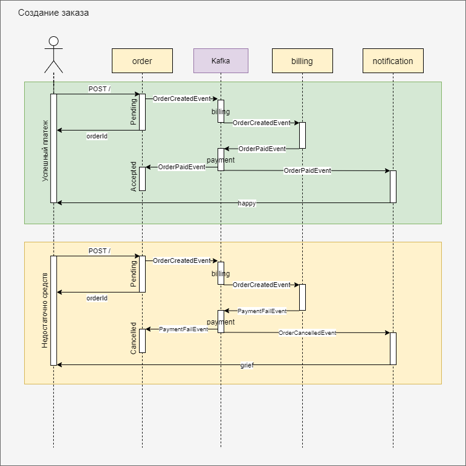
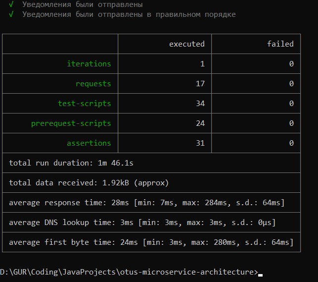

## Домашнее задание №9. StreamProcessing. Events

Реализовать событийное взаимодействие в микросервисной архитектуре

---

### Описание приложения:
- [Сервис Заказа]
  Пользователь имеет возможность создать заказ. Сервис делает запрос в сервис Биллинга для оплаты заказа.
  
- [Сервис Биллинга]
  Пользователь имеет возможность пополнить счет. Сервис отправляет запрос в сервис Уведомлений для отправки пиcем клиенту.
  Сервис принимает запросы для оплаты созданного заказа.

- [Сервис Уведомлений]
  Сервис принимает запросы для отправки писем клиенту

## Варианты реализации

  ### I. Только HTTP взаимодействие.
  
  
  

  ### II. HTTP взаимодействие для оплаты, отправка уведмолений через брокер сообщений.
  
  
  

  ### III. Межсервисное взаимодействие посредством обмена сообщениями через брокера.
  
  
  
---  

### Для реализации на практике был выбран вариант III, используя соыбтийной взаимодействие через Kafka.

- [Сервис Заказа](https://github.com/GUR-ok/arch-order)
  * Пользователь создает заказ посредством HTTP запроса. Сервис отправляет событие в очередь, что заказ создан.
  Заказу присваивается статус PENDING.
  * После проведение платежа в сервисе Биллинга сервис принимает событие об успешной/неуспешной оплате заказа.
  Заказ получает статус APPROVED/CANCELED.
  * Сервис подключен к реляционной БД для хранения данных заказа
  
- [Сервис Биллинга](https://github.com/GUR-ok/arch-billing)
  * Сервис **не использует** реляционные БД. Для хранения информации используются KafkaStreams,
  для извлечения информации о состоянии счета - KTable и GlobalKTable.
  * Пополнение счета происходит через очередь сообщений. Чтобы в Postman иметь возможность отправлять сообщения в очередь
  и не запускать отдельный kafka-connector,
  создан коннектор-эндпоинт, принимающий http-запрос. Эндпоинт отправляет сообщение в очередь о внесении депозита.
  * После списания средств сервис отправляет сообщение в очередь об успешной/неуспешной оплате заказа.

- [Сервис Уведомлений](https://github.com/GUR-ok/arch-notification)
  * Сервис принимает сообщения об успешной/неуспешной оплате, а также о внесении депозита на счет.
  * Сервис отправляет письма клиенту (в демонстрационных целях сообщения кладутся в БД).
  
### API

Order Service:
AsyncAPI спецификация: [order-async-api.yaml](https://github.com/GUR-ok/otus-microservice-architecture/tree/master/hw9/order-async-api.yaml)
- PUBLISH [OrderCreatedEvent]
- SUBSCRIBE [OrderPaidEvent, PaymentFailEvent]
  
Billing Service:
AsyncAPI спецификация: [billing-async-api.yaml](https://github.com/GUR-ok/otus-microservice-architecture/tree/master/hw9/billing-async-api.yaml)
- PUBLISH [OrderPaidEvent, PaymentFailEvent, DepositAcceptedEvent]
- SUBSCRIBE [OrderCreatedEvent, DepositRequestEvent]

Notification Service:
AsyncAPI спецификация: [notification-async-api.yaml](https://github.com/GUR-ok/otus-microservice-architecture/tree/master/hw9/notification-async-api.yaml)
- PUBLISH [],
- SUBSCRIBE [OrderPaidEvent, PaymentFailEvent, DepositAcceptedEvent]

topics - events:
- billing [OrderCreatedEvent, DepositRequestEvent]
- payment [OrderPaidEvent, PaymentFailEvent, DepositAcceptedEvent]

---

### Инструкция по запуску:
- `minikube start --vm-driver virtualbox --no-vtx-check`
- `kubectl create namespace arch-gur`
- Использовать nginx ingress controller установленный через хелм, а не встроенный в minikube:

  ```
  kubectl delete namespace ingress-nginx
  kubectl delete ingressClass nginx
  kubectl create namespace m && helm repo add ingress-nginx https://kubernetes.github.io/ingress-nginx/ && helm repo update && helm install nginx ingress-nginx/ingress-nginx --namespace m -f nginx-ingress.yaml
  ```

- `helm install gorelov-kafka ./hw9/kafka/`
- `helm install gorelov-arch-billing ./hw9/billing_deployment/`
- `helm install gorelov-arch-notification ./hw9/notification_deployment/`
- `helm install gorelov-arch-order ./hw9/order_deployment/`

  `kubectl get pods -n arch-gur`
- В случае ошибки при деплое приложения через helm

  Error: INSTALLATION FAILED: Internal error occurred: failed calling webhook "validate.nginx.ingress.kubernetes.io": Post "https://ingress-nginx-controller-admission.ingress-nginx.svc:4
  43/networking/v1/ingresses?timeout=10s": dial tcp 10.111.50.42:443: connect: connection refused

  необходимо выполнить:
    ```
    kubectl get ValidatingWebhookConfiguration
    kubectl delete -A ValidatingWebhookConfiguration nginx-ingress-nginx-admission
    ```  
- дождаться поднятия подов

---

### Тесты:

- `newman run ./hw9/gorelov_hw_9.postman_collection.json --verbose`

#### Результаты тестов:

Скриншоты с тестами в [папке](./screenshots).


---

### Проверка и отладка:


`kubectl port-forward -n arch-gur kafka-manager-7b8fb9f6c6-dxc4g 9000:9000`
на localhost:9000 будет доступна панель кафка менеджера


### Очистка пространства:

- `helm uninstall nginx -n m`
- `helm uninstall gorelov-arch-billing`
- `helm uninstall gorelov-arch-notification`
- `helm uninstall gorelov-arch-order`
- `helm uninstall gorelov-kafka`
- `kubectl delete namespace arch-gur`
- `kubectl delete namespace m`