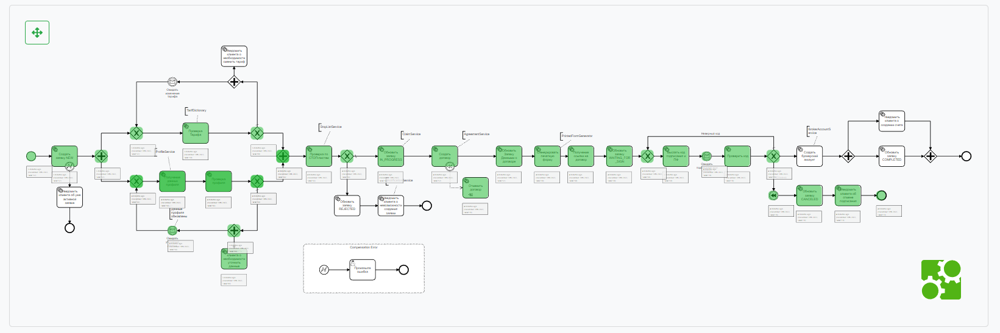
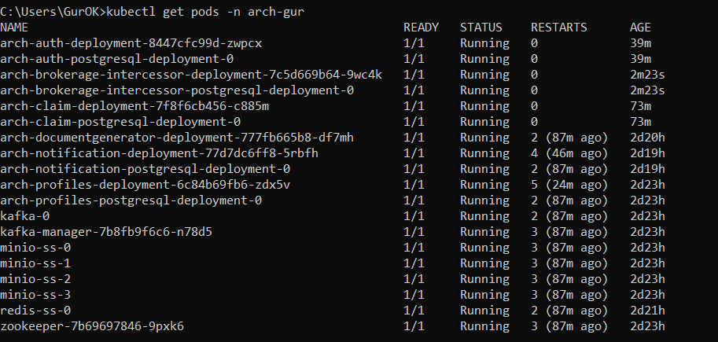

### Проект "Брокерское обслуживание клиентов с использованием микросервисной архитектуры"

### **Компоненты приложения:**

#### *Основные сервисы:*
- Сервис Аутентификации (СА) https://github.com/GUR-ok/arch-auth https://hub.docker.com/repository/docker/gurok/arch_auth _3
- Сервис Управления Профилем (СУП) https://github.com/GUR-ok/arch-profiles https://hub.docker.com/repository/docker/gurok/arch_profiles_3
- Сервис-оркестартор распределенного процесса Интцерцессор https://github.com/GUR-ok/arch-brokerage-intercessor https://hub.docker.com/repository/docker/gurok/arch_brokerage_intercessor
- Сервис Заявки. https://github.com/GUR-ok/arch-claim https://hub.docker.com/repository/docker/gurok/arch_claim
- Сервис Уведомлений. https://github.com/GUR-ok/arch-notification https://hub.docker.com/repository/docker/gurok/arch_notification_2
- Сервис генерации Документов. https://github.com/GUR-ok/arch-documentgenerator https://hub.docker.com/repository/docker/gurok/arch_documentgenerator

#### *Дополнительные сервисы (в проекте застабированы для экономии ресурсов):*
- Сервис проверки по Стоп-листам https://github.com/GUR-ok/arch-stoplist
- Сервис Договора https://github.com/GUR-ok/arch-agreement
- Сервис Брокерских счетов https://github.com/GUR-ok/arch-brokerageaccount
- Сервис справочник Тарифов https://github.com/GUR-ok/arch-productdictionary

#### *Базы Данных:*
- Реляционные БД (PostgreSQL):
  
  СА хранит данные юзеров (userId, login, password, profileId);
  
  СУП хранит данные профиля (profileId, fullName, age, ...);

  Интерцессор в БД хранит данные процессов Camunda;
  
  Сервис Заявки хранит данные заявки (processId, profileId, state, updated, firstName, agrrementNumber, brokerageAccountId);
  
  Сервис уведомлений имитирует отправку сообщений пользователю, сохраняя текст в БД.
  
- Нереляционные БД:

  Redis для хранения данных сессии и jwt. Используется Сервисом Авторизации

#### *Инфраструктура:*
- Настроенный Istio API-gateway с проверкой авторизации по jwt.
- Envoy-фильтр, умеющий добавлять кастомные хедеры, проводить доп.валидацию сессии и т.д. Используется для получения profileId из токена и проброске upstream хедером в микросервисы
- Брокер сообщений Kafka для связи микросервисов.
- Minio хранилище для хранения pdf-файлов сгенерированных договоров на открытие счета.

### **Описание приложения:**
I. Регистрация, логин, логаут пользователя

1) Запросы на /auth/ не требуют авторизации (перенаправляются на СА), остальные запросы требуют передачи валидного jwt (
   перенаправляются на СУП).
2) Пользователю доступны API /auth/register, /auth/login, /auth/logout, а также API управления Профилем с доступом по токену
   авторизации.
3) При первичной регистрации пользователя на /auth/register СА обращается к СУП для создания профиля. Полученный
   profileId привязывается к userId. Login и Password (в bcrypt шифрованном виде) сохраняются в БД СА.
4) После регистрации клиент может залогиниться на /auth/login, в ответ получит подписанный сервисом аутентификации jwt.
   Jwt содержит id профиля profileId (из сервиса управления Профилем), созданного при регистрации.
   Данные о сессии и jwt сохраняются в Redis. При обращении на /auth/logout/ происходи удаление информации о сессии и jwt из Redis.
5) Сервис аутентификации СА имеет пару ключей (хранятся в jks): приватным ключом подписывается jwt; публичный ключ
   открытый, предоставляется по адресу /auth/.well-known/jwks.json
6) Istio ingressgateway имеет настроенный EnvoyFilter, обрабатывающий запросы (кроме запросов на /auth/) до проверки подписи jwt.
   Фильтр вызывает СА и проверяет наличие jwt и сессии в хранилище Redis. Фильтр может добавлять доп. хедеры в запрос.
7) Istio ingressgateway настроен на проверку валидности подписи jwt при помощи публичного ключа.
   При валидном jwt полезные данные из jwt направляются header'ом "x-jwt-token" в микросервис.
8) При запросе изменения профиля в СУП проверяется profileId из jwt на совпадение с id 
   запрашиваемого профиля. В случае попытки запроса чужого профиля запрос считается 
   неавторизованным. Верификация и проверка подписи jwt в СУП не производится, 
   за верификацию отвечает Istio.

//todo

#### Инструкция по запуску:

Старт миникуба и Istio:

- `minikube start --vm-driver virtualbox --no-vtx-check --memory=24Gb --cpus=6 --disk-size=60Gb`
- `kubectl delete namespace ingress-nginx`
- `kubectl delete ingressClass nginx`
- `istioctl install --set profile=demo -y`
- `istioctl manifest apply -f ./project/istio/istio-values.yaml`

Опционально:

- `kubectl apply -f https://raw.githubusercontent.com/istio/istio/release-1.11/samples/addons/prometheus.yaml`
- `kubectl apply -f https://raw.githubusercontent.com/istio/istio/release-1.11/samples/addons/kiali.yaml`

Пуск инфраструктуры:

- `kubectl create namespace arch-gur`
- `helm install gorelov-arch-istio ./project/istio/`
- `helm install gorelov-arch-minio ./project/minio/`
- `helm install gorelov-kafka ./project/kafka/`
- `helm install gorelov-redis ./project/redis/ -f ./project/redis/values.yaml`

Пуск основных сервисов:

- `helm install gorelov-arch-auth ./project/auth_deployment/`
- `helm install gorelov-arch-profiles ./project/profiles_deployment/`
- `helm install gorelov-arch-brokerage-intercessor ./project/intercessor/`
- `helm install gorelov-arch-claim ./project/services/claim_deployment/`
- `helm install gorelov-arch-notification ./project/notification_deployment/`
- `helm install gorelov-arch-document-generator ./project/services/documentgenerator_deployment/`

Дополнительные сервисы (в проекте застабированы для экономии ресурсов):

- `helm install gorelov-arch-product-dictionary ./project/services/productdictionary_deployment/`
- `helm install gorelov-arch-stoplists ./project/service/stoplist_deployment/`
- `helm install gorelov-arch-brokerage-account ./project/services/brokerageaccount_deployment/`
- `helm install gorelov-arch-agreement ./project/services/agreement_deployment/`

#### Диагностика, проверка портов и Istio:

- `minikube ip` ip должен быть указан в C:\Windows\System32\drivers\etc\hosts
  как arch.homework
- `kubectl get virtualService`
- `kubectl get svc -n istio-system`(должен быть порт 30001)
- `kubectl get svc -n arch-gur`
  
  kafka-manager                 NodePort    10.101.112.105   <none>        9000:30170/TCP
  
  Для входа в kafka-manager http://arch.homework:30170/
- Просмотр логов подов `kubectl logs -f -n arch-gur arch-profiles-deployment-67d58c5b57-x25q4`  
- Проброс портов на локалхост: `kubectl port-forward -n arch-gur redis-ss-0 6379:6379`
- `istioctl dashboard kiali`
- `kubectl describe node minikube`

Для демонстрации процесса:
1. Для управления процессами. Запустить Excamad в докере на локальной машине 'docker run -d -p 8080:8080 kotovdenis/excamad:latest'
Админская панель Excamad по адресу http://localhost:8080/#/?baseurl=http%3A%2F%2Flocalhost%3A8081%2Fengine-rest%2F
   Пробросить порт Интерцессора на локалхост
   ``
   kubectl get pods -n arch-gur
   kubectl port-forward -n arch-gur arch-brokerage-intercessor-deployment-7c5d669b64-dqglz 8081:8000
   ``
   Учетка: demo demo

2. Контроль сообщений пользователю смотреть в БД
   `kubectl port-forward -n arch-gur arch-notification-postgresql-deployment-0 5435:5432`
   Название БД: arch_notification_db
   Учетка: admin password  
3. Контроль статусов заявок смотреть в БД
   `kubectl port-forward -n arch-gur arch-claim-postgresql-deployment-0 5436:5432`
   Название БД: arch_claim_db 
   Учетка: admin password  
4. Файловое хранилище доступно по адресу http://arch.homework:30002/minio/
   Учетка: minio_access_key minio_secret_key

---

#### Очистка пространства:

- `helm uninstall gorelov-arch-claim`
- `helm uninstall gorelov-arch-document-generator`
- `helm uninstall gorelov-arch-brokerage-intercessor`
- `helm uninstall gorelov-arch-auth`
- `helm uninstall gorelov-arch-profiles`
- `helm uninstall gorelov-arch-notification`  

- `helm uninstall gorelov-arch-product-dictionary`
- `helm uninstall gorelov-arch-stoplists`
- `helm uninstall gorelov-arch-agreement`
- `helm uninstall gorelov-arch-brokerage-account`
  

- `helm uninstall gorelov-arch-minio`
- `istioctl x uninstall --purge`
- `helm uninstall gorelov-kafka`
- `helm uninstall gorelov-redis`
- `helm uninstall gorelov-arch-istio`
- `kubectl delete namespace arch-gur`
- `kubectl delete namespace istio-system` 