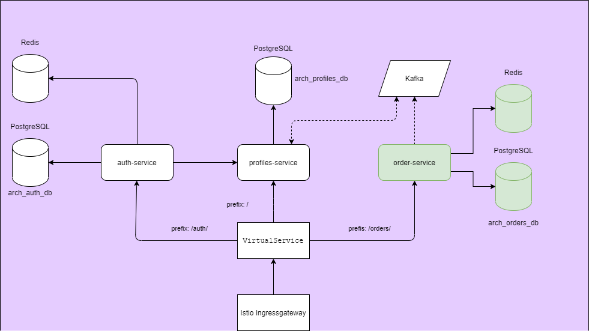

### Проект

### **Компоненты приложения:**

- Сервис Аутентификации (СА) https://github.com/GUR-ok/arch-auth https://hub.docker.com/repository/docker/gurok/arch_auth 
- Сервис Управления Профилем (СУП) https://github.com/GUR-ok/arch-profiles https://hub.docker.com/repository/docker/gurok/arch_profiles_2
- Сервис Управления Заказом (СУЗ) https://github.com/GUR-ok/arch-order https://hub.docker.com/repository/docker/gurok/arch_order
- БД: каждый микросервис подключен к своей БД:
  СА хранит данные юзеров (userId, login, password, profileId), СУП хранит данные профиля (profileId, fullName, age,
  ...).
- Настроенный Istio API-gateway с проверкой авторизации по jwt.
- Envoy-фильтр, умеющий добавлять кастомные хедеры, проводить доп.валидацию сессии и т.д. 
- Redis для хранения данных сессии и jwt. СА подключен в redis.
- Брокер сообщений Kafka для связи микросервисов.

### **Описание приложения:**
I. Регистрация, логин, логаут пользователя

1) Запросы на /auth/ не требуют авторизации (перенаправляются на СА), остальные запросы требуют передачи валидного jwt (
   перенаправляются на СУП).
2) Пользователю доступны API /auth/register, /auth/login, /auth/logout, а также API управления Профилем с доступом по токену
   авторизации.
3) При первичной регистрации пользователя на /auth/register СА обращается к СУП для создания профиля. Полученный
   profileId привязывается к userId. Login и Password (в bcrypt шифрованном виде) сохраняются в БД СА.
4) После регистрации клиент может залогиниться на /auth/login, в ответ получит подписанный сервисом аутентификации jwt.
   Jwt содержит id профиля profileId (из сервиса управления Профилем), созданного при регистрации.
   Данные о сессии и jwt сохраняются в Redis. При обращении на /auth/logout/ происходи удаление информации о сессии и jwt из Redis.
5) Сервис аутентификации СА имеет пару ключей (хранятся в jks): приватным ключом подписывается jwt; публичный ключ
   открытый, предоставляется по адресу /auth/.well-known/jwks.json
6) Istio ingressgateway имеет настроенный EnvoyFilter, обрабатывающий запросы (кроме запросов на /auth/) до проверки подписи jwt.
   Фильтр вызывает СА и проверяет наличие jwt и сессии в хранилище Redis. Фильтр может добавлять доп. хедеры в запрос.
7) Istio ingressgateway настроен на проверку валидности подписи jwt при помощи публичного ключа.
   При валидном jwt полезные данные из jwt направляются header'ом "x-jwt-token" в микросервис.
8) При запросе изменения профиля в СУП проверяется profileId из jwt на совпадение с id 
   запрашиваемого профиля. В случае попытки запроса чужого профиля запрос считается 
   неавторизованным. Верификация и проверка подписи jwt в СУП не производится, 
   за верификацию отвечает Istio.
9) СУП подключен к брокеру сообщений Kafka.  
   
II. Создание заказа

1) Ключ идемпотентности в реквесте
2) Сохранение ключа и проверка

#### Инструкция по запуску:

- `minikube start`
- `kubectl delete namespace ingress-nginx`
- `kubectl delete ingressClass nginx`
- `kubectl create namespace arch-gur`
- `helm install gorelov-kafka ./project/kafka/`
- `helm install gorelov-redis ./project/redis/ -f ./project/redis/auth-values.yaml`
- `helm install gorelov-redis-order ./project/redis/ -f ./project/redis/order-values.yaml`
- `istioctl install --set profile=demo -y`
- `istioctl manifest apply -f ./project/istio/istio-values.yaml`
- `kubectl apply -f https://raw.githubusercontent.com/istio/istio/release-1.11/samples/addons/prometheus.yaml`
- `kubectl apply -f https://raw.githubusercontent.com/istio/istio/release-1.11/samples/addons/kiali.yaml`
- `helm install gorelov-arch-project ./project/istio/`
- `helm install gorelov-arch-auth ./project/auth_deployment/`
- `helm install gorelov-arch-profiles ./project/profiles_deployment/`

#### Диагностика, проверка портов и istio:

- `kubectl get virtualService`
- `kubectl get svc -n istio-system`
  (должен быть порт 30001)
- `kubectl get svc -n arch-gur`
  kafka-manager                 NodePort    10.101.112.105   <none>        9000:30170/TCP
  Для входа в kafka-manager http://arch.homework:30170/
- `kubectl port-forward -n arch-gur arch-profiles-deployment-67d58c5b57-x25q4 8080:8000`
- http://localhost:8080/swagger-ui/index.html#/kafka-controller/sendString
- `kubectl logs -f -n arch-gur arch-profiles-deployment-67d58c5b57-x25q4`  
- `kubectl port-forward -n arch-gur redis-ss-0 6379:6379`
- `istioctl dashboard kiali`

---
#### Очистка пространства:

- `helm uninstall gorelov-arch-project`
- `helm uninstall gorelov-arch-auth`
- `helm uninstall gorelov-arch-profiles`
- `istioctl x uninstall --purge`
- `kubectl delete namespace arch-gur`
- `kubectl delete namespace istio-system`  
- `helm uninstall gorelov-kafka`
- `helm uninstall gorelov-redis`
- `helm uninstall gorelov-redis-order`
