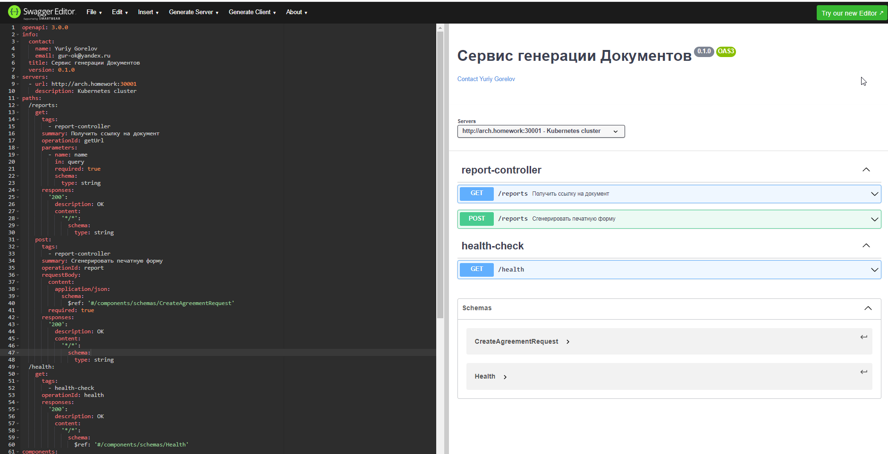

### Проект "Брокерское обслуживание клиентов с использованием микросервисной архитектуры"

### **Компоненты приложения:**

#### **Основные сервисы:**
- [**Сервис Аутентификации и Авторизации (СА)**](https://github.com/GUR-ok/arch-auth)

    Сервис предоставляет API для авторизации пользователя: регистрация, логин, логаут.
    При первичной регистрации обращается в Сервис Управления Профилем для создания профиля пользователя.
    Сервис выдает и сохраняет в Redis токен авторизации jwt, подписанный приватным ключом,
    а также предоставляет доступ к публичному ключу для валидации jwt в Istio.
    Сервис предоставляет методы обработки запросов для Envoy фильтра Istio,
    в частности валидирует jwt на наличие в базе данных активных токенов (в случае компрометации jwt может быть удален из БД и не пройдет валидацию)
    и извлекает profileId из токена для проброса дальше upstream'ом в отдельном хедере.

  OpenAPI спецификация: [openapi-auth.yaml](https://github.com/GUR-ok/otus-microservice-architecture/tree/master/project/services/openapi-auth.yaml)
  
  Образ: https://hub.docker.com/repository/docker/gurok/arch_auth_3

- [**Сервис Управления Профилем (СУП)**](https://github.com/GUR-ok/arch-profiles)

    Сервис предоставляет возможность создавать и редактировать профиль пользователя.

  OpenAPI спецификация: [openapi-profile.yaml](https://github.com/GUR-ok/otus-microservice-architecture/tree/master/project/services/openapi-profile.yaml)
  
  Образ: https://hub.docker.com/repository/docker/gurok/arch_profiles_3
  

- [**Интерцессор. Сервис-оркестратор распределенного процесса**](https://github.com/GUR-ok/arch-brokerage-intercessor)

    Сервис под управлением Camunda (встроена в SpringBoot), основывается на bpmn-схеме,
    к которой привязаны java-делегаты. Интеграция с другими сервисами осуществляется как по REST-api,
    так и через брокеры сообщений. Входящие запросы - по HTTP.
    Отмена локальных транзакций в микросервисах осуществляется посредством компенсирующих вызовов (паттерн "Сага").
    В случае возникновения исключений на шагах распредлеленной транзакции механизмы Camunda перехватят ошибку и
    произведут компенсирующие действия только для пройденных шагов.
    Camunda позволяет дополнительно настраивать ретраи, что при реализации идемпотентных api значительно повысит надежность системы.

  OpenAPI спецификация: [openapi-intercessor.yaml](https://github.com/GUR-ok/otus-microservice-architecture/tree/master/project/services/openapi-intercessor.yaml)
  
  Async API спецификация: [intercessor-async-api.yaml](https://github.com/GUR-ok/otus-microservice-architecture/tree/master/project/services/intercessor-async-api.yaml)
 
  Образ: https://hub.docker.com/repository/docker/gurok/arch_brokerage_intercessor
  

- [**Сервис Заявки**](https://github.com/GUR-ok/arch-claim)

    Сервис для хранения данных заявки на открытие брокерского счета.
    При создании новой заявки, предыдущие заявки в статусе NEW переходят в состояние CANCELLED. 
    Если у пользователя есть заявки в сотсояниях IN_PROGRESS или WAITING_FOR_SIGN, то интерцессор не разрешит создание новой заявки.
    
    Статусная модель:
    
    

  OpenAPI спецификация: [openapi-claim.yaml](https://github.com/GUR-ok/otus-microservice-architecture/tree/master/project/services/openapi-claim.yaml)
  
  Async API спецификация: [claim-async-api.yaml](https://github.com/GUR-ok/otus-microservice-architecture/tree/master/project/services/claim-async-api.yaml)

  Образ: https://hub.docker.com/repository/docker/gurok/arch_claim
  

- [**Сервис Уведомлений**](https://github.com/GUR-ok/arch-notification)

    Сервис принимает сообщения об изменении статуса заявки.
    Сервис отправляет письма клиенту об изменении статуса заявки,
    а также отправляет клиенту код подтверждения и ссылку на скачивание договора 
    (в демонстрационных целях сообщения кладутся в БД).

  OpenAPI спецификация: [openapi-notification.yaml](https://github.com/GUR-ok/otus-microservice-architecture/tree/master/project/services/openapi-notification.yaml)
  
  Async API спецификация: [notification-async-api.yaml](https://github.com/GUR-ok/otus-microservice-architecture/tree/master/project/services/notification-async-api.yaml)
 
  Образ: https://hub.docker.com/repository/docker/gurok/arch_notification_2
  

- [**Сервис генерации Документов**](https://github.com/GUR-ok/arch-documentgenerator)

    Сервис генерирует печатную форму договора в формате .pdf,
    сохраняет печатную форму в файловое хранилище и получает ссылку на скачивание.

  OpenAPI спецификация: [openapi-documentgenerator.yaml](https://github.com/GUR-ok/otus-microservice-architecture/tree/master/project/services/openapi-documentgenerator.yaml)
  
  Образ: https://hub.docker.com/repository/docker/gurok/arch_documentgenerator

#### **Дополнительные сервисы (в проекте застабированы для экономии ресурсов):**

- [Сервис проверки по Стоп-листам](https://github.com/GUR-ok/arch-stoplist)
  
    Сервис проверяет паспорт клиента по черным спискам.
    В проекте застабирован (паспорт с номером 123456 считается валидным, остальные - в черных списках)

- [Сервис Договора](https://github.com/GUR-ok/arch-agreement)
  
    Создает запись с данынми договора в БД. Возвращает номер договора. 
    В проекте застабирован (возвращает случайное число)
  
- [Сервис Брокерских счетов](https://github.com/GUR-ok/arch-brokerageaccount)
  
    Создает запись брокерского счета в БД. Возвращает идентификатор счета. 
    В проекте застабирован (возвращает случайное идентификатор)
- [Сервис справочник Тарифов](https://github.com/GUR-ok/arch-productdictionary)
  
    Проверяет признак активного тарифа по идентификатору тарифа. 
    В проекте застабирован (продукт с id 111 счиатется активным, остальные нет)
  
#### **Базы Данных:**
- Реляционные БД (PostgreSQL):
  
  СА хранит данные юзеров (userId, login, password, profileId);
  
  СУП хранит данные профиля (profileId, fullName, age, ...);

  Интерцессор в БД хранит данные процессов Camunda;
  
  Сервис Заявки хранит данные заявки (processId, profileId, state, updated, firstName, agrrementNumber, brokerageAccountId);
  
  Сервис уведомлений имитирует отправку сообщений пользователю, сохраняя текст в БД.
  
- Нереляционные БД:

  Redis для хранения данных сессии и jwt. Используется Сервисом Авторизации

#### **Инфраструктура:**
- Настроенный Istio API-gateway с проверкой авторизации по jwt.
- Envoy-фильтр, умеющий добавлять кастомные хедеры, проводить доп.валидацию сессии и т.д. Используется для получения profileId из токена и проброске upstream хедером в микросервисы
- Брокер сообщений Kafka для связи микросервисов.
- Minio хранилище для хранения pdf-файлов сгенерированных договоров на открытие счета.

### **Описание приложения:**
I. Регистрация, логин, логаут пользователя

1) Запросы на /auth/ не требуют авторизации (перенаправляются на СА), остальные запросы требуют передачи валидного jwt (
   перенаправляются на СУП).
2) Пользователю доступны API /auth/register, /auth/login, /auth/logout, а также API управления Профилем с доступом по токену
   авторизации.
3) При первичной регистрации пользователя на /auth/register СА обращается к СУП для создания профиля. Полученный
   profileId привязывается к userId. Login и Password (в bcrypt шифрованном виде) сохраняются в БД СА.
4) После регистрации клиент может залогиниться на /auth/login, в ответ получит подписанный сервисом аутентификации jwt.
   Jwt содержит id профиля profileId (из сервиса управления Профилем), созданного при регистрации.
   Данные о сессии и jwt сохраняются в Redis. При обращении на /auth/logout/ происходи удаление информации о сессии и jwt из Redis.
5) Сервис аутентификации СА имеет пару ключей (хранятся в jks): приватным ключом подписывается jwt; публичный ключ
   открытый, предоставляется по адресу /auth/.well-known/jwks.json
6) Istio ingressgateway имеет настроенный EnvoyFilter, обрабатывающий запросы (кроме запросов на /auth/) до проверки подписи jwt.
   Фильтр вызывает СА и проверяет наличие jwt и сессии в хранилище Redis. Фильтр может добавлять доп. хедеры в запрос.
7) Istio ingressgateway настроен на проверку валидности подписи jwt при помощи публичного ключа.
   При валидном jwt полезные данные из jwt направляются header'ом "x-jwt-token" в микросервис.
8) При запросе изменения профиля в СУП проверяется profileId из jwt на совпадение с id 
   запрашиваемого профиля. В случае попытки запроса чужого профиля запрос считается 
   неавторизованным. Верификация и проверка подписи jwt в СУП не производится, 
   за верификацию отвечает Istio.

II. Создание заявки

1) После успешной авторизации пользователь с jwt обращается в Интерцессор /intercessor/process/events, 
   где в теле передает идентификатор тарифа и событие NEW_CLAIM_RECEIVED.
2) Истио EnvoyFilter извлекает profileId из jwt и прокидывает в Интерцессор в хедерах.
3) Интерцессор запускает процесс на bpmn схеме, возвращает идентификатор процесса.
4) По схеме сначала проверяется наличие у клиента заявок на стадии подписания. 
   Если таких заявок нет, то заводится новая заявка в сервисе Заявок.
   Иначе клиент уведомляется о невозможности создания заявки.
5) После создания заявки проверяется заполненность паспортных данных клиента и признак 
   активного тарифа. В случае неуспешной проверки, клиент уведомляется
   о необходимости уточнить паспортные данные или изменить тариф.
6) После успешных проверок паспорт проверяется по черным спискам. Если проверка не прошла,
   то заявка переходит в статус REJECTED и клиент уведомляется.  
7) После успешной проверки по черным спискам, заявка переходит в состояние IN_PROGRESS и 
   создается договор в сервисе Договора. Заявка в сервисе Заявок обновляется данными о договоре.
8) Генерируется печатная форма договора в сервисе Генерации Документов, создается ссылка на скачивание pdf-документа.
9) Заявка переходит в состояние WAITING_FOR_SIGN, генерируется код подтверждения и высылается клиенту вместе
   со ссылкой на скачивание документа договора.
10) Пользователь может:
   * ввести правильный код - создастся брокерский счет в сервисе Брокерского Счета, произойдет уведомление клиента,
     заявка перейдет в статус DONE.
   * отменить подписание - заявка перейдет в статус CANCELLED, произойдет компенсирующий вызов,
     аннулирующий договор в сервисе Договора.
   * ввести неправильный код - в таком случае будет выслан новый код

#### Инструкция по запуску:

Старт миникуба и Istio:

- `minikube start --vm-driver virtualbox --no-vtx-check --memory=24Gb --cpus=6 --disk-size=60Gb`
- `kubectl delete namespace ingress-nginx`
- `kubectl delete ingressClass nginx`
- `istioctl install --set profile=demo -y`
- `istioctl manifest apply -f ./project/istio/istio-values.yaml`

Опционально:

- `kubectl apply -f https://raw.githubusercontent.com/istio/istio/release-1.11/samples/addons/prometheus.yaml`
- `kubectl apply -f https://raw.githubusercontent.com/istio/istio/release-1.11/samples/addons/kiali.yaml`

Пуск инфраструктуры:

- `kubectl create namespace arch-gur`
- `helm install gorelov-arch-istio ./project/istio/`
- `helm install gorelov-arch-minio ./project/minio/`
- `helm install gorelov-kafka ./project/kafka/`
- `helm install gorelov-redis ./project/redis/ -f ./project/redis/values.yaml`

Пуск основных сервисов:

- `helm install gorelov-arch-auth ./project/services/auth_deployment/`
- `helm install gorelov-arch-profiles ./project/services/profiles_deployment/`
- `helm install gorelov-arch-brokerage-intercessor ./project/services/intercessor/`
- `helm install gorelov-arch-claim ./project/services/claim_deployment/`
- `helm install gorelov-arch-notification ./project/services/notification_deployment/`
- `helm install gorelov-arch-document-generator ./project/services/documentgenerator_deployment/`

Full Start:
`helm install gorelov-arch-auth ./project/services/auth_deployment/ && helm install gorelov-arch-profiles ./project/services/profiles_deployment/ && helm install gorelov-arch-brokerage-intercessor ./project/services/intercessor/ && helm install gorelov-arch-claim ./project/services/claim_deployment/ && helm install gorelov-arch-notification ./project/services/notification_deployment/ && helm install gorelov-arch-document-generator ./project/services/documentgenerator_deployment/`

Дополнительные сервисы (в проекте застабированы для экономии ресурсов):

- `helm install gorelov-arch-product-dictionary ./project/services/productdictionary_deployment/`
- `helm install gorelov-arch-stoplists ./project/service/stoplist_deployment/`
- `helm install gorelov-arch-brokerage-account ./project/services/brokerageaccount_deployment/`
- `helm install gorelov-arch-agreement ./project/services/agreement_deployment/`

#### Диагностика, проверка портов и Istio:

- `minikube ip` ip должен быть указан в C:\Windows\System32\drivers\etc\hosts
  как arch.homework
- `kubectl get virtualService`
- `kubectl get svc -n istio-system`(должен быть порт 30001)
- `kubectl get svc -n arch-gur`
  
  Если после рестарта ноды истио не работает, то выполнить заново
- `istioctl install --set profile=demo -y`
  
  kafka-manager                 NodePort    10.101.112.105   <none>        9000:30170/TCP
  
  Для входа в kafka-manager http://arch.homework:30170/
- Просмотр логов подов `kubectl logs -f -n arch-gur arch-profiles-deployment-67d58c5b57-x25q4`  
- Проброс портов на локалхост: `kubectl port-forward -n arch-gur redis-ss-0 6379:6379`
- `istioctl dashboard kiali`
- `kubectl describe node minikube`

- `kubectl port-forward -n arch-gur arch-profiles-postgresql-deployment-0 5433:5432`
- `kubectl port-forward -n arch-gur arch-auth-postgresql-deployment-0 5439:5432`

Для демонстрации процесса:
1. Для управления процессами. Запустить Excamad в докере на локальной машине `docker run -d -p 8080:8080 kotovdenis/excamad:latest`
   
   Админская панель Excamad по адресу http://localhost:8080/#/?baseurl=http%3A%2F%2Flocalhost%3A8081%2Fengine-rest%2F
   
   Пробросить порт Интерцессора на локалхост
   ``
   kubectl get pods -n arch-gur
   kubectl port-forward -n arch-gur arch-brokerage-intercessor-deployment-7c5d669b64-dqglz 8081:8000
   ``
   
   В настрйоках экзамада указать адрес подключаемой камунды http://localhost:8081/engine-rest/
    * Учетка: demo demo

2. Контроль сообщений пользователю смотреть в БД
   `kubectl port-forward -n arch-gur arch-notification-postgresql-deployment-0 5435:5432`
   * Название БД: arch_notification_db
   * Учетка: admin password  
3. Контроль статусов заявок смотреть в БД
   `kubectl port-forward -n arch-gur arch-claim-postgresql-deployment-0 5436:5432`
   * Название БД: arch_claim_db 
   * Учетка: admin password  
4. Файловое хранилище доступно по адресу http://arch.homework:30002/minio/
   * Учетка: minio_access_key minio_secret_key

---

#### Очистка пространства:

- `helm uninstall gorelov-arch-claim`
- `helm uninstall gorelov-arch-document-generator`
- `helm uninstall gorelov-arch-brokerage-intercessor`
- `helm uninstall gorelov-arch-auth`
- `helm uninstall gorelov-arch-profiles`
- `helm uninstall gorelov-arch-notification`

- `helm uninstall gorelov-arch-product-dictionary`
- `helm uninstall gorelov-arch-stoplists`
- `helm uninstall gorelov-arch-agreement`
- `helm uninstall gorelov-arch-brokerage-account`

- `helm uninstall gorelov-arch-minio`
- `istioctl x uninstall --purge`
- `helm uninstall gorelov-kafka`
- `helm uninstall gorelov-redis`
- `helm uninstall gorelov-arch-istio`
- `kubectl delete namespace arch-gur`
- `kubectl delete namespace istio-system` 

Stop services:
`helm uninstall gorelov-arch-claim && helm uninstall gorelov-arch-document-generator && helm uninstall gorelov-arch-brokerage-intercessor && helm uninstall gorelov-arch-auth && helm uninstall gorelov-arch-profiles && helm uninstall gorelov-arch-notification`
